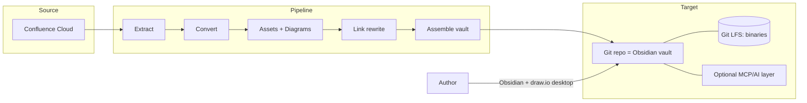
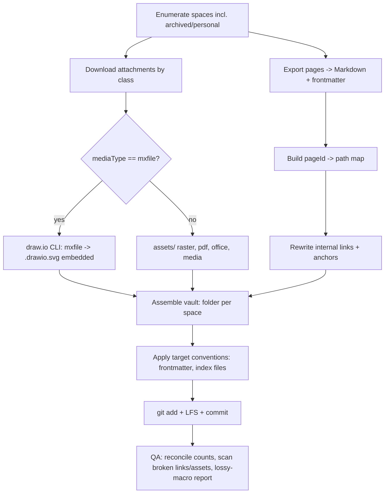
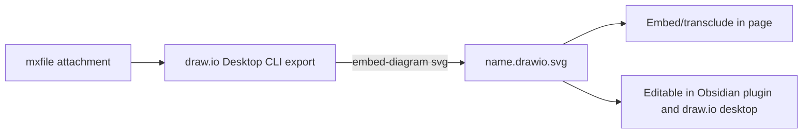
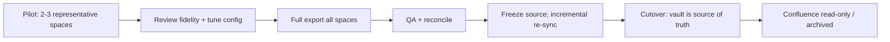

# Concept: Migrating Confluence to a Markdown Knowledge Base

> A vendor-neutral, reusable concept for moving a complete Confluence Cloud
> instance into a **Git-backed Markdown knowledge base** that doubles as an
> **Obsidian vault**, while keeping **draw.io diagrams editable locally**.
>
> This document is intentionally **company-agnostic**. It contains no
> instance-, client-, or company-specific data. Where a real instance is
> referenced, it is only to surface a generic *edge case* so that no class of
> content is forgotten during a migration.

---

## Table of contents

1. [Part 1 — High level: why and what](#part-1--high-level-why-and-what)
2. [Part 2 — Source model: what a Confluence instance contains](#part-2--source-model-what-a-confluence-instance-contains)
3. [Part 3 — Edge-case catalog](#part-3--edge-case-catalog)
4. [Part 4 — Technical export approach](#part-4--technical-export-approach)
5. [Part 5 — Adaptability checklist](#part-5--adaptability-checklist)
6. [Appendix A — Reference toolchain](#appendix-a--reference-toolchain)
7. [Appendix B — Glossary](#appendix-b--glossary)

---

# Part 1 — High level: why and what

## 1.1 Vision

Replace a hosted, proprietary wiki with a **portable, local-first knowledge
base** that you fully own:

- **Markdown** as the canonical content format — readable, diffable, future-proof.
- **Git** as the system of record — history, review, backup, branching, sync.
- **Obsidian** as the primary editor and reader — links, search, graph, plugins.
- **draw.io (diagrams.net) locally** for diagrams — edited offline, stored as
  source you control, never re-locked into a SaaS.

The result is a knowledge base with **no vendor lock-in**: every artifact is a
plain file on disk, versioned in Git, and editable with free, open tools.

## 1.2 Principles

| Principle | What it means in practice |
|-----------|---------------------------|
| **Lossless-as-possible** | Preserve text, structure, metadata, attachments, and diagrams. Where a construct cannot map 1:1, capture a faithful static snapshot and record the loss explicitly. |
| **Idempotent & repeatable** | The migration is a script/config, not a one-off manual click-through. Re-running it converges to the same result and only re-processes what changed. |
| **Automation-first** | Humans review and decide; tools do the bulk extraction and conversion. Manual steps are the exception, documented and minimized. |
| **Human-reviewable** | Output is clean Markdown a person can read in a diff. No opaque blobs in the text layer. |
| **Secrets-safe** | API tokens live in the environment, never in the repo. Private content goes to private repos. Optional anonymization for shared/public mirrors. |
| **Incremental cutover** | A pilot validates fidelity before the full run; an incremental re-sync keeps the target current during the freeze/cutover window. |

## 1.3 Target architecture



Core decisions baked into the architecture (each is a tunable **parameter**, see
[Part 5](#part-5--adaptability-checklist)):

- **One repo = one vault**, with **one top-level folder per Confluence space**.
  (Multi-repo / repo-per-space is an option for strict data isolation.)
- **Assets co-located per space** (`<space>/assets/…`) so a space is
  self-contained and movable.
- **Diagrams stored as editable source** (`<space>/diagrams/*.drawio.svg`).
- **Git LFS** for binary blobs (images, PDFs, Office, archives, media).
- **Optional AI layer** (e.g. an MCP server) reads the vault for search/Q&A.

## 1.4 Decision parameters (set once per instance)

Before any export, decide:

1. **Scope** — all spaces, or a subset? Include personal and archived spaces?
2. **Repo layout** — mono-repo, repo-per-space, or internal-vs-client split?
3. **Anonymization** — keep author/email metadata, or strip/pseudonymize it?
4. **Attachment policy** — download all, only referenced, or none?
5. **History** — current versions only, or reconstruct page history into Git commits?
6. **Naming/structure** — flat per space, or mirror the page hierarchy as folders?

These are captured concretely in the [adaptability checklist](#part-5--adaptability-checklist).

---

# Part 2 — Source model: what a Confluence instance contains

To avoid forgetting anything, treat Confluence as a typed content graph and map
each type deliberately.

## 2.1 Content taxonomy

| Confluence concept | Notes | Target mapping |
|--------------------|-------|----------------|
| **Site / Cloud instance** | Identified by a `cloudId`; one or more accessible resources per token. | Root of the migration; one run per site. |
| **Space** | Types: `global`, `personal`, `collaboration`, `knowledge_base`. Status: `current` or `archived`. Has a key, name, homepage. | One top-level folder per space (configurable). |
| **Page** | Hierarchical (parent/child, ancestors). The primary unit. | One `.md` file; hierarchy → nested folders + folder note. |
| **Blog post** | Time-stamped posts; may be absent in many instances. | One `.md` file under a `Blog/` subfolder (date-prefixed). |
| **Comment** | `footer` (page-level) and `inline` (anchored to text). | Sidecar `.md` next to the page, or an appended section. |
| **Attachment** | Files bound to a page; each has a `mediaType`, `fileId`, size. | Downloaded into the page's space assets/diagrams folder. |
| **Label** | Tags on pages/spaces. | YAML `tags:` in frontmatter. |
| **Page properties** | Key/value metadata, plus dynamic "report" rollups. | YAML frontmatter; reports → static snapshot (+ optional live query). |
| **Restrictions** | Per-page/space read/write limits. | Affects token scope; flagged in the migration report. |
| **Version / history** | Numbered versions, authors, timestamps, edit messages. | Frontmatter (`created`, `updated`, `author`); full history optional. |

## 2.2 Body formats and why the format choice matters

A single page can be requested in several representations, and **they are not
equivalent in fidelity**:

| Format | Fidelity | Good for |
|--------|----------|----------|
| **ADF** (Atlassian Document Format, JSON) | Highest programmatic fidelity | Lossless programmatic transforms |
| **Storage / XHTML** | High; preserves macros as structured elements | Reliable macro detection & conversion |
| **View / rendered HTML** | Medium; macros already rendered to HTML | Visual fidelity, but loses macro semantics |
| **API "markdown"** | Lowest; convenient but **lossy** | Quick text, simple pages only |

> **Key insight (drives the whole approach):** the API's *markdown*
> representation can return an **empty or partial body** for pages whose content
> is contained in macros (a diagram-only page, for example). A robust migration
> therefore relies on **storage/XHTML or ADF** (via a dedicated exporter) for the
> page body, and pulls macro payloads (like diagrams) **separately** from their
> attachments. Never assume the API markdown is complete.

## 2.3 Macro inventory and mapping

Macros are the main source of fidelity risk. Plan a mapping for each:

| Confluence macro | Markdown / Obsidian target | Notes |
|------------------|----------------------------|-------|
| Info / Note / Tip / Warning panel | Callout (`> [!NOTE]`, `> [!WARNING]`, …) | Direct, clean mapping. |
| Code block | Fenced code block with language | Preserve language hint. |
| Table | Markdown table (or HTML for complex spans) | Merged cells may need HTML fallback. |
| Task list | `- [ ]` / `- [x]` | Preserve completion state. |
| Status badge | Inline highlight / shield text | Color becomes inline style or label. |
| Expand / collapse | `<details><summary>` | Native HTML works in Obsidian. |
| Table of contents | Auto-TOC plugin or omit | Markdown headings make it redundant. |
| Include / Excerpt | Obsidian transclusion (`![[Page]]`) or inline copy | Choose per use; record which. |
| Page properties | YAML frontmatter | Stable key/value. |
| Page properties **report** | Static snapshot table (+ optional live Dataview query) | Dynamic rollup cannot be live without a plugin. |
| Attachments macro | Link list to local files | Resolve to relative paths. |
| **draw.io / Gliffy diagram** | Local editable diagram (`*.drawio.svg`) + image render | See [4.5](#45-drawio-sub-pipeline). |
| Jira / external-service macros | Static link + snapshot text | Live data is out of scope; preserve a readable trace. |

> Any macro without a clean target is converted to a **faithful static
> representation** and **logged** in the migration report so nothing silently
> disappears.

## 2.4 Attachment classes

Plan handling per class, not per file:

| Class | Typical formats | Handling |
|-------|-----------------|----------|
| **Raster images** | png, jpg/jpeg, gif | Download to `assets/`; reference relatively; Git LFS. |
| **Vector images** | svg | Download; keep as text in Git (diffable). |
| **Documents** | pdf, docx, xlsx, pptx, csv | Download to `assets/`; link from page; Git LFS. |
| **Archives** | zip, tar, gz | Download; link; Git LFS. |
| **Media** | mp4, mov, mp3 | Download; link; Git LFS (watch repo size). |
| **Diagrams** | `application/vnd.jgraph.mxfile` (draw.io), `.tmp`, PNG previews | Special pipeline → `*.drawio.svg` (see 4.5). |

---

# Part 3 — Edge-case catalog

These are the traps that silently lose content. The list below is generalized
from analyzing a **real, mature instance** (dozens of spaces, ~1k pages,
several thousand attachments, heavy diagram use). Treat it as a pre-flight
checklist.

1. **Macro-only pages return an empty API-markdown body.**
   Diagram-only or layout-only pages look "empty" via the markdown endpoint.
   → Use storage/XHTML or a dedicated exporter; cross-check that every page has
   either body text *or* a known macro/attachment.

2. **draw.io is stored in up to three places at once.**
   A diagram typically exists as (a) a macro reference in the page body,
   (b) an `application/vnd.jgraph.mxfile` attachment (the editable XML), and
   (c) a PNG preview attachment. **Only the mxfile is the editable source.**
   → Pull the mxfile, not just the preview, and convert it (4.5).

3. **Diagram drafts and temp files.**
   `~drawio~…`, `*.drawio.tmp`, autosave artifacts pollute the attachment list.
   → Filter temp/draft artifacts; keep only the latest real diagram.

4. **Very high image volume with auto-generated names.**
   Screenshot tools and pasted images create many near-duplicate, oddly-named
   files; collisions across pages are common.
   → Namespace assets per page/space and key on the stable `fileId`, not the
   display filename.

5. **Archived and personal spaces are often skipped by bulk exporters.**
   "Export everything" frequently means "export current global spaces."
   → Enumerate **all** spaces explicitly (including `archived` and `personal`)
   and export the stragglers individually.

6. **Restricted pages/spaces require an admin-scope token.**
   A normal user token silently omits content it cannot read.
   → Use a token whose user can read every in-scope space; reconcile counts
   afterward to detect silent omissions.

7. **Internal links, "tiny" links, and anchors break on move.**
   Pages link to each other by ID, by short/tiny URL, and to in-page anchors.
   → Build a `pageId → file path` map and rewrite all internal links to
   relative Markdown links; map heading anchors too.

8. **Include / excerpt macros create cross-page dependencies.**
   Content displayed on page A actually lives on page B.
   → Decide per case: transclude (`![[…]]`) or inline a copy; record the choice.

9. **Page-properties *reports* are dynamic.**
   They compute a table across many pages at view time.
   → Snapshot the current result; optionally emit a live query (e.g. Dataview)
   for editors who install the plugin.

10. **Duplicate page titles.**
    Titles repeat within and across spaces; naive title-based filenames collide.
    → Disambiguate by hierarchy path and/or page ID suffix.

11. **Non-ASCII space keys, aliases, long names.**
    Space keys may be truncated/aliased; titles may contain characters illegal
    in filenames or too long for some filesystems.
    → Sanitize and length-limit filenames; keep the original title in frontmatter.

12. **API pagination and rate limits.**
    Thousands of objects mean paged responses and throttling.
    → Page through everything; back off and retry; prefer incremental runs that
    skip unchanged content.

13. **Few or zero comments — but don't assume zero.**
    Even instances with "no comments" usually have a handful of inline ones.
    → Always export comments (as sidecars) rather than skipping the type.

14. **Repo size from binaries.**
    Several thousand attachments can mean gigabytes.
    → Git LFS for binaries from commit #1 (retrofitting LFS later is painful).

---

# Part 4 — Technical export approach

## 4.1 Toolchain

| Role | Tool | Why |
|------|------|-----|
| Extraction + Markdown conversion | **`confluence-markdown-exporter`** (CLI) | Exports pages/spaces/whole org via the API to clean Markdown with YAML frontmatter, labels→tags, panels→callouts, tables, tasks, code, attachments, comments-as-sidecars, includes→transclusions; has an Obsidian preset and **incremental** re-runs. |
| Diagram conversion | **draw.io Desktop CLI** | Converts `mxfile` → `.drawio.svg` with **embedded editable XML** (renders as an image *and* reopens for editing). |
| Versioning + large files | **Git + Git LFS** | History, sync, and binary handling. |
| Editing + reading | **Obsidian** + a **draw.io plugin** | Local-first editor; the plugin edits `.drawio.svg` offline. |
| Fallback converter | **Pandoc** (optional) | For pages/macros the primary exporter cannot handle, convert from storage/XHTML. |

> The toolchain is a recommendation, not a hard dependency. Any exporter that
> reads **storage/XHTML or ADF** (not just API-markdown) and downloads
> attachments can fill the "extraction" role; the rest of the pipeline is
> unchanged.

## 4.2 Pipeline overview



## 4.3 Extraction & conversion

1. **Authenticate** with an API token whose user can read all in-scope spaces.
   Store it in an environment variable; never commit it.
2. **Enumerate every space** and classify by type/status. Build the work list
   explicitly so archived/personal spaces are included by intent, not by luck.
3. **Export pages** per space using storage/XHTML (or ADF) as the source body.
   Produce one Markdown file per page with **YAML frontmatter** and the page
   hierarchy mirrored as folders.
4. **Export comments** as sidecar files next to each page.
5. Keep the run **incremental** so re-running only touches changed pages —
   essential for the cutover window.

## 4.4 Asset handling

- Download attachments by **stable `fileId`**, not display name, to avoid
  collisions; store under `<space>/assets/<fileId>.<ext>` (path template is a
  parameter).
- Reference assets with **relative links** so the vault is portable.
- Route binary classes to **Git LFS**; keep `svg` and `.drawio.svg` as text.
- Skip temp/draft artifacts; keep the latest version of each real attachment.

## 4.5 draw.io sub-pipeline

The crux of "keep draw.io, but local":



- For every attachment with `mediaType = application/vnd.jgraph.mxfile`,
  export to **`*.drawio.svg`** with the **diagram XML embedded** (e.g.
  `drawio --export --format svg --embed-diagram --output name.drawio.svg name.mxfile`).
- The resulting file is a **valid SVG** (renders inline everywhere) **and** a
  valid draw.io document (reopens for editing) — so a single file is both the
  picture and the editable source.
- Store under `<space>/diagrams/` and rewrite the page's diagram macro to embed
  the `.drawio.svg`.
- Editing afterward: open via the Obsidian **draw.io plugin** (offline, local
  server) or draw.io **Desktop**; save writes back to the same file, and Git
  tracks the change.

> Prefer `.drawio.svg` over `.drawio.png`: SVG is text-friendlier for diffs and
> scales cleanly. Keep the original `mxfile` too if you want a pure-XML diff
> history.

## 4.6 Link & structure rewriting

- Build a **`pageId → relative path`** map during export.
- Rewrite: internal page links, tiny/short links, attachment links, and
  in-page heading anchors → relative Markdown links / Obsidian wikilinks.
- For parent pages, generate a **folder note / index** so the hierarchy is
  navigable.
- Emit any unresolved links to the migration report.

## 4.7 Validation & QA

- **Count reconciliation:** spaces, pages, comments, and attachments in the
  source vs. produced files. Investigate every delta (often reveals restricted
  or archived content that was silently skipped).
- **Broken-link / missing-asset scan** across the vault.
- **Lossy-macro report:** list every macro that became a static snapshot.
- **Spot checks** across each space *type* (global/personal/collaboration/KB)
  and content shape (text-heavy, table-heavy, diagram-only, attachment-heavy).
- Record results in a `migration_report.md` checked into the repo.

## 4.8 Security & anonymization

- Tokens in environment variables / secret stores only.
- Private source → **private repo**.
- Optional **anonymization toggle**: strip or pseudonymize author names/emails
  and redact known sensitive patterns before commit (useful for shared or
  public mirrors of an otherwise private KB).

## 4.9 Phasing & cutover



- **Pilot** on the hardest spaces first (one diagram-heavy, one
  attachment-heavy, one deeply nested) to expose issues early.
- **Freeze** edits on the source during cutover; run an **incremental re-sync**
  to catch last-minute changes.
- After sign-off, set the source **read-only/archived** so there is a single
  source of truth.

---

# Part 5 — Adaptability checklist

Fill this in once per company/instance; the pipeline is otherwise unchanged.

## 5.1 Parameter sheet

| Parameter | Options | Default |
|-----------|---------|---------|
| **Scope** | all spaces / subset / by type | all current + archived |
| **Personal spaces** | include / exclude | exclude |
| **Repo layout** | mono-repo / repo-per-space / internal+client split | mono-repo |
| **Hierarchy** | mirror page tree as folders / flat per space | mirror |
| **Attachment policy** | all / referenced-only / none | referenced-only |
| **History** | current only / full history → commits | current only |
| **Anonymization** | keep / strip / pseudonymize authors | keep (private repo) |
| **Diagram format** | `.drawio.svg` / `.drawio.png` / keep mxfile too | `.drawio.svg` (+ mxfile) |
| **LFS classes** | which extensions go to LFS | png,jpg,jpeg,gif,pdf,zip,mp4,mov,docx,xlsx,pptx |
| **Comments** | sidecar / appended / skip | sidecar |
| **Includes/excerpts** | transclude / inline | transclude |

## 5.2 Target-convention presets (pluggable)

The same export can target different KB conventions by swapping a preset. A
typical Obsidian-in-Git preset defines:

- **Frontmatter schema**, e.g.:

```yaml
---
title:
date: YYYY-MM-DD          # created
updated: YYYY-MM-DD
tags: []                  # from labels
type: reference | meeting | project | internal | personal
source: <original-url>    # provenance
source_id: <page-id>      # for re-sync
status: active | archived | draft
---
```

- **Filename convention** (e.g. `YYYYMMDD Title.md` for dated notes, or
  `Title.md` mirroring the page tree).
- **Index files** (e.g. a master `_index.md`, a per-category index, and an
  AI-instructions file) that are regenerated from frontmatter after each run.
- **Git LFS rules** (`.gitattributes`) and **`.gitignore`** (exclude editor
  workspace/cache and temp files).
- **Optional MCP/AI layer**: a server that reads the vault for search and Q&A;
  scale up (full-text index → vector search) as the vault grows.

## 5.3 Repository layout (reference)

```
knowledge-base/                 # git root == Obsidian vault
  .gitattributes                # Git LFS rules
  .gitignore                    # workspace/cache, *.tmp
  README.md                     # how to edit/sync
  _index.md                     # generated master index
  migration_report.md           # counts, lossy macros, open issues
  _meta/
    pageid_map.csv              # pageId -> path (link rewrite + re-sync)
  <Space A>/
    <Page>.md
    <Page>/<Child>.md           # hierarchy as folders
    assets/<fileId>.<ext>       # images, pdf, office, media
    diagrams/<name>.drawio.svg  # editable diagrams
  <Space B>/
    ...
```

## 5.4 One-page runbook

1. Set parameters (5.1) and choose a target preset (5.2).
2. Configure the exporter (scope, paths, frontmatter, callouts, attachments).
3. Run the **pilot** on the hardest spaces; review and tune.
4. Run the **full export** across all spaces (incl. archived/personal).
5. Run the **diagram sub-pipeline** (mxfile → `.drawio.svg`).
6. Rewrite links; assemble the vault; apply target conventions.
7. Initialize Git + LFS; commit; push to a private remote.
8. **QA**: reconcile counts, scan links/assets, write the migration report.
9. Open in Obsidian; verify rendering and a few diagram edits.
10. Freeze source → incremental re-sync → cutover → set source read-only.

---

# Appendix A — Reference toolchain

| Tool | Purpose | Notes |
|------|---------|-------|
| `confluence-markdown-exporter` | Confluence → Markdown (pages/spaces/org) | Reads via API; frontmatter, callouts, attachments, comments, includes; Obsidian preset; incremental. |
| draw.io Desktop (CLI) | `mxfile` → `.drawio.svg` (embedded XML) | Produces files that render as images and reopen for editing. |
| Obsidian | Editor / reader | Folder-per-space vault; relative links. |
| Obsidian draw.io plugin | Edit `.drawio.svg` in-vault | Offline/local; right-click → edit. |
| Git + Git LFS | Versioning + binaries | LFS from the first commit. |
| Pandoc (optional) | Fallback conversion | From storage/XHTML for stubborn macros. |

---

# Appendix B — Glossary

- **ADF** — Atlassian Document Format; Confluence's structured JSON body.
- **Storage format** — Confluence's XHTML body that preserves macros as elements.
- **Macro** — a dynamic content block in a page (panel, code, diagram, include…).
- **mxfile** — draw.io's native XML diagram format (`application/vnd.jgraph.mxfile`).
- **`.drawio.svg`** — an SVG image with the editable draw.io XML embedded.
- **Transclusion** — embedding one note's content inside another (`![[Note]]`).
- **Git LFS** — Large File Storage; keeps big binaries out of the main Git history.
- **Frontmatter** — YAML metadata block at the top of a Markdown file.
- **Incremental export** — re-processing only content changed since the last run.
