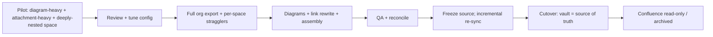

# Technical Plan: Confluence → Markdown / Obsidian Migration

> Execution-ready companion to the high-level `concept.md`. This document
> commits to a concrete, **100% free-tool** toolchain and gives the exact
> commands, configuration, and sequencing to migrate a Confluence Cloud
> instance into a Git-backed Markdown vault with locally-editable draw.io
> diagrams.
>
> Status: **plan only** — nothing here has been executed yet.

---

## 0. Licensing & cost (the "free tools only" constraint)

The full pipeline runs on free, mostly open-source software. No paid license is
required.

| Tool | Role | License / cost | Verdict |
|------|------|----------------|---------|
| **confluence-markdown-exporter (`cme`)** | Confluence → Markdown conversion engine | MIT, free | Use |
| **Confluence Cloud REST API + CQL** | Attachment inventory/download, count reconciliation | Included with the existing Confluence subscription; no extra license | Use |
| **draw.io Desktop** (`drawio-desktop`) | `mxfile → .drawio.svg` conversion | Apache-2.0, free (incl. commercial) | Use |
| **draw.io / diagrams Obsidian plugin** | Edit `.drawio.svg` in-vault, offline | Free, open source | Use |
| **Obsidian** | Editor / reader | **Free for all use incl. commercial** (the old $50/user/yr commercial-license requirement was dropped Feb 2025) | Use (optional) |
| **Git + Git LFS** | Versioning + large binaries | Free / open source | Use |
| **Python + pipx** | Run `cme` | Free / open source | Use |

**Explicitly avoided (paid / license-gated):**

- Appfire "ACLI" (Bob Swift) and other commercial `atlassian-cli` distributions — paid marketplace apps.
- Atlassian Marketplace "Markdown Exporter" apps — paid, GUI/one-click, less scriptable.
- Obsidian **Sync** ($/mo) and **Publish** ($/mo) add-ons — not needed; **Git is our sync**.

**Cost edge cases to watch (not licenses, but quotas):**

- **Git LFS storage/bandwidth quotas** on hosted providers (e.g. GitHub's free LFS tier is limited). With several thousand attachments this can be exceeded. Mitigations, in order of preference: (a) self-hosted Git remote, (b) GitLab/other provider with a larger free LFS allowance, (c) keep binaries in the repo without LFS if total size stays modest, (d) a private remote you control.
- **Editor independence:** because the vault is just Markdown + assets in Git, it is **editor-agnostic**. Obsidian is the recommended reader, but the same files open in VS Code / VSCodium (with Foam/Dendron) or Logseq — all free — so we are never locked to one editor even if Obsidian's terms ever change again.

---

## 1. Scope & toolchain decision

### 1.1 Is the Atlassian CLI the best tool? (direct answer)

No — not for a Confluence → Markdown migration.

- **Official Atlassian `acli`** is centered on Jira work items and the Rovo Dev
  agent. It does not convert Confluence content to Markdown. Not applicable.
- **Appfire "ACLI" / generic `atlassian-cli`** can list spaces, export space
  content, and download attachments, but its export output is **JSON or HTML**,
  not clean Markdown. It performs **no** macro→callout conversion, **no**
  draw.io handling, and **no** Obsidian wikilink rewriting — and the capable
  distributions are **paid**, which our constraint rules out.

A migration needs a tool that understands Confluence **storage/ADF** semantics
and emits structured Markdown. That is a purpose-built exporter, not a generic
admin CLI.

### 1.2 Decision matrix

| Capability | `cme` (chosen) | Appfire/generic CLI | Marketplace app |
|------------|:--------------:|:-------------------:|:---------------:|
| Confluence → clean Markdown | Yes | No (JSON/HTML) | Yes |
| Macros → callouts/tables/tasks | Yes | No | Partial |
| YAML frontmatter (labels, properties) | Yes | No | Partial |
| Attachments downloaded + linked | Yes | Yes (raw) | Yes (ZIP) |
| Obsidian wikilinks / transclusion | Yes | No | Partial |
| Incremental re-export | Yes | No | No |
| Scriptable / CI-friendly | Yes | Yes | Limited |
| **Free** | **Yes (MIT)** | No (paid) | No (paid) |

### 1.3 Chosen hybrid toolchain

- **`cme`** — primary engine: pages/spaces/whole-org → Markdown + frontmatter,
  panels→callouts, tables, task lists, code, comments-as-sidecars,
  include/excerpt→transclusion, attachment download, Obsidian preset,
  incremental runs.
- **REST API (v2 + CQL)** — surgical helper: enumerate spaces (incl. archived /
  personal), inventory attachments by `mediaType`, bulk-download draw.io
  `mxfile` sources, and reconcile counts.
- **draw.io Desktop CLI** — convert each `mxfile` to an editable `.drawio.svg`.

### 1.4 Instance facts this run must satisfy

- 1 site / `cloudId`; ~**54 spaces** (including archived + personal).
- **957 pages**, **0 blog posts**, **2 comments**, **5,844 attachments**
  (~1,815 images, 36 PDFs, ~6 Office, ~12 zip/media, large draw.io remainder).
- Verified gotcha: the API **markdown** body is **empty for macro-only/diagram
  pages** → we rely on `cme` (storage/ADF) for bodies and pull diagrams
  separately from their `mxfile` attachments.

---

## 2. Prerequisites & authentication

### 2.1 Accounts & permissions

- A Confluence account that can **read every in-scope space**. Archived and
  personal spaces typically require **Confluence/site admin** scope — use an
  admin account or have an admin run the export, otherwise restricted content
  is silently skipped (caught later by count reconciliation).

### 2.2 API token (no password in repo)

1. Create an API token at `id.atlassian.com` → Security → API tokens.
2. Export it as environment variables (never commit):

```bash
export CONFLUENCE_URL="https://<site>.atlassian.net/wiki"
export CONFLUENCE_USERNAME="you@example.com"
export CONFLUENCE_API_TOKEN="<api-token>"
```

> Keep these in a local `.env` that is git-ignored (or a secret manager).
> Basic auth for REST = `-u "$CONFLUENCE_USERNAME:$CONFLUENCE_API_TOKEN"`.

### 2.3 Installs (all free)

```bash
# Python tooling + the exporter
python3 -m pip install --user pipx && pipx ensurepath
pipx install confluence-markdown-exporter      # provides `cme`

# Diagrams (macOS example; Linux: install drawio-desktop, run headless via xvfb)
brew install --cask drawio                      # draw.io Desktop (Apache-2.0)

# Version control
brew install git git-lfs && git lfs install

# Editor (free; optional — vault is editor-agnostic)
brew install --cask obsidian
```

---

## 3. Extraction & conversion (`cme`)

### 3.1 Configure once

`cme` reads a JSON config (set interactively with `cme config`, or via a config
file / `CME_*` env overrides for CI). Target values:

| Setting | Value | Why |
|---------|-------|-----|
| `export.output_path` | `./vault` | Build into a staging vault folder. |
| `export.page_path` | `{space_name}/{ancestor_titles}/{page_title}.md` | Mirror hierarchy as folders. |
| `export.page_href` | `relative` | Portable internal links. |
| `export.attachment_path` | `{space_name}/assets/{attachment_file_id}{attachment_extension}` | Stable, collision-free (keyed on `fileId`). |
| `export.attachment_href` | `relative` | Portable asset links. |
| `export.attachments_export` | `all` | Preserve everything (we re-handle diagrams in §4). |
| `export.page_properties_format` | `frontmatter` | Properties → YAML. |
| `export.page_properties_report_format` | `snapshot` | Static table now; optional Dataview later. |
| `export.confluence_url_in_frontmatter` | `true` | Provenance + re-sync key. |
| Panels / tasks / code | (default) | → callouts / `- [ ]` / fenced code. |
| Comments | sidecar files | Keep the 2 inline comments next to their page. |
| Include / excerpt | transclusion (`![[…]]`) | Preserve cross-page embeds. |

### 3.2 Run the export

```bash
# Whole organisation (every space cme can see)
cme orgs "$CONFLUENCE_URL"

# Fallback: export stragglers individually (archived / personal spaces that
# the org-level run may skip). Repeat per space key or URL:
cme spaces "https://<site>.atlassian.net/wiki/spaces/<SPACEKEY>"
```

> Re-running is **incremental** — unchanged pages are skipped — which makes the
> later cutover re-sync cheap.

### 3.3 Verify enumeration is complete

Before trusting the org run, list every space and diff against produced
folders (admin token surfaces archived/personal):

```bash
curl -s -u "$CONFLUENCE_USERNAME:$CONFLUENCE_API_TOKEN" \
  "$CONFLUENCE_URL/api/v2/spaces?limit=250&status=current" \
  | jq -r '.results[] | [.key,.type,.status] | @tsv'
curl -s -u "$CONFLUENCE_USERNAME:$CONFLUENCE_API_TOKEN" \
  "$CONFLUENCE_URL/api/v2/spaces?limit=250&status=archived" \
  | jq -r '.results[] | [.key,.type,.status] | @tsv'
```

---

## 4. Attachments & diagrams (draw.io, kept local)

### 4.1 Inventory attachments by media type

```bash
# Totals per content type (CQL totalSize)
curl -s -u "$CONFLUENCE_USERNAME:$CONFLUENCE_API_TOKEN" \
  "$CONFLUENCE_URL/rest/api/search?cql=type=attachment&limit=1" | jq '.totalSize'

# Page through all attachments, capturing mediaType + download link + page id
# (follow _links.next until absent); store as attachments_inventory.csv
```

Key class to single out: **`application/vnd.jgraph.mxfile`** — the editable
draw.io source. Also note PNG previews and `~drawio~*` / `*.drawio.tmp`
autosave artifacts (to be filtered out).

### 4.2 Download the draw.io sources

For every `mxfile` attachment, download via its page-scoped endpoint:

```bash
curl -sL -u "$CONFLUENCE_USERNAME:$CONFLUENCE_API_TOKEN" \
  "$CONFLUENCE_URL/rest/api/content/<pageId>/child/attachment/<attId>/download" \
  -o "vault/<SpaceName>/diagrams/<name>.drawio"
```

### 4.3 Convert to editable `.drawio.svg`

Produce an SVG that **renders as an image and reopens for editing** (XML
embedded):

```bash
# macOS binary path; Linux: drawio (run under xvfb-run for headless)
/Applications/draw.io.app/Contents/MacOS/draw.io \
  --export --format svg --embed-diagram \
  --output "vault/<SpaceName>/diagrams/<name>.drawio.svg" \
  "vault/<SpaceName>/diagrams/<name>.drawio"
```

- Loop over all downloaded `.drawio` files.
- **Filter** `*.drawio.tmp` and `~drawio~*` artifacts; keep only the latest real
  diagram per page.
- Optionally keep the raw `.drawio` (pure XML) alongside the `.drawio.svg` for
  cleaner diffs.

### 4.4 Rewrite diagram references in pages

`cme` renders a diagram macro as its PNG preview (or a placeholder). Replace
those references with the editable SVG so Obsidian shows the picture and the
draw.io plugin can edit it:

```text
# before (preview image cme produced)

# after (editable, embedded)
![[<SpaceName>/diagrams/<name>.drawio.svg]]
```

Implement as a scripted find/replace driven by the attachment inventory
(page id → diagram name → target path).

### 4.5 Non-diagram attachments

Images, PDFs, Office, archives, media already land under
`<space>/assets/<fileId>.<ext>` from `cme`; leave them and route binaries to LFS
(§6).

---

## 5. Link rewriting & vault assembly

### 5.1 Build a page-id → path map

From the `cme` output (frontmatter carries the source URL / page id), generate
`_meta/pageid_map.csv`:

```csv
page_id,space_key,relative_path
98997,Developmen,Development/Home.md
...
```

### 5.2 Rewrite links and anchors

- Internal page links and **tiny links** (`/wiki/x/<id>`) → relative Markdown
  links or `[[wikilinks]]` using the map.
- In-page heading anchors → Obsidian `#heading` form.
- Attachment links → relative `assets/…` / `diagrams/…` paths.
- Emit unresolved links to the migration report.

### 5.3 Hierarchy navigation

For each parent page, generate a folder note / `index.md` so the tree is
browsable in Obsidian and on the Git host.

### 5.4 Obsidian configuration (optional but recommended)

`.obsidian/app.json`:

```json
{
  "newLinkFormat": "relative",
  "useMarkdownLinks": false,
  "attachmentFolderPath": "./assets"
}
```

Install the **draw.io / diagrams** community plugin (free) and enable it so
`.drawio.svg` files are click-to-edit, fully offline.

### 5.5 Target conventions (configurable preset)

Align frontmatter and indexes with the destination KB. Example frontmatter the
rewrite step should ensure exists:

```yaml
---
title:
date: YYYY-MM-DD        # created
updated: YYYY-MM-DD
tags: []                # from labels
type: reference | meeting | project | internal
source: <confluence-url>
source_id: <page-id>
status: active | archived | draft
---
```

Regenerate index files (`_index.md`, etc.) from frontmatter after assembly.

---

## 6. Git & Git LFS

### 6.1 `.gitattributes` (binaries → LFS, text stays diffable)

```gitattributes
*.png  filter=lfs diff=lfs merge=lfs -text
*.jpg  filter=lfs diff=lfs merge=lfs -text
*.jpeg filter=lfs diff=lfs merge=lfs -text
*.gif  filter=lfs diff=lfs merge=lfs -text
*.pdf  filter=lfs diff=lfs merge=lfs -text
*.zip  filter=lfs diff=lfs merge=lfs -text
*.mp4  filter=lfs diff=lfs merge=lfs -text
*.mov  filter=lfs diff=lfs merge=lfs -text
*.docx filter=lfs diff=lfs merge=lfs -text
*.xlsx filter=lfs diff=lfs merge=lfs -text
*.pptx filter=lfs diff=lfs merge=lfs -text
# Keep as text (NOT LFS): *.md, *.svg, *.drawio, *.drawio.svg
```

### 6.2 `.gitignore`

```gitignore
.env
.obsidian/workspace.json
.obsidian/workspace-mobile.json
.obsidian/cache
*.tmp
~drawio~*
.DS_Store
```

### 6.3 Initialize & commit

```bash
cd vault
git init && git lfs install
git add .gitattributes .gitignore
git add .
git commit -m "Initial Confluence migration import"
# Add a PRIVATE remote you control (mind LFS quota — see §0); then push.
```

> Set up LFS **before** the first content commit — retrofitting LFS onto an
> existing history is painful.

---

## 7. QA & validation

### 7.1 Count reconciliation (source vs. vault)

| Object | Source (CQL `totalSize`) | Vault check |
|--------|--------------------------|-------------|
| Spaces | ~54 (current + archived) | top-level folders |
| Pages | 957 | `*.md` count (minus index/sidecar) |
| Comments | 2 | comment sidecar files |
| Attachments | 5,844 | files under `assets/` + `diagrams/` |

```bash
curl -s -u "$CONFLUENCE_USERNAME:$CONFLUENCE_API_TOKEN" \
  "$CONFLUENCE_URL/rest/api/search?cql=type=page&limit=1" | jq '.totalSize'
```

Investigate every delta — a shortfall usually means restricted/archived content
skipped by an under-scoped token.

### 7.2 Integrity scans

- Broken internal links / missing assets scan across the vault.
- Diagram check: every page that had a draw.io macro now references a
  `.drawio.svg` that exists and opens.
- **Lossy-macro report:** list any macro converted to a static snapshot
  (page-properties reports, Jira/external macros).

### 7.3 Spot checks

One page per space **type** (global / personal / collaboration / knowledge_base)
and per shape (text-heavy, table-heavy, diagram-only, attachment-heavy).
Record results in `migration_report.md` (committed).

---

## 8. Phasing & cutover



- **Pilot** the hardest spaces first to expose issues cheaply.
- **Freeze** edits on Confluence during cutover; run an **incremental `cme`
  re-sync** to capture last-minute changes.
- After sign-off, set Confluence **read-only/archived** so there is a single
  source of truth.

---

## 9. Risks & mitigations

| Risk | Mitigation |
|------|------------|
| Restricted pages silently skipped | Use admin-scope token; reconcile counts (§7.1). |
| API rate limits / pagination | Throttle + retry; follow `_links.next`; rely on incremental re-runs. |
| Diagram-only pages look "empty" | Bodies come from `cme` (storage/ADF), diagrams from `mxfile` (§4). |
| Duplicate page titles | Hierarchy path + page-id suffix disambiguation. |
| Non-ASCII / overlong filenames | Sanitize + length-limit; keep original title in frontmatter. |
| Repo size / LFS quota | LFS from commit #1; pick a remote with adequate free LFS (§0). |
| draw.io headless on Linux | Run the CLI under `xvfb-run`. |
| Editor lock-in worry | Vault is plain Markdown + Git — opens in Obsidian, VS Code/VSCodium, Logseq (all free). |

---

## 10. Runbook (ordered checklist)

1. Set env vars (§2.2); install tools (§2.3).
2. `cme config` → apply settings (§3.1).
3. Enumerate spaces; confirm archived/personal are visible (§3.3).
4. **Pilot**: `cme spaces <hard-space>`; review fidelity; tune.
5. Full export: `cme orgs "$CONFLUENCE_URL"`; then per-space stragglers (§3.2).
6. Attachment inventory → CSV (§4.1).
7. Download `mxfile` sources (§4.2) → convert to `.drawio.svg` (§4.3) → filter temp.
8. Build `pageid_map.csv`; rewrite links/anchors + diagram refs (§4.4, §5.1–5.2).
9. Add folder notes; apply Obsidian config + frontmatter/index conventions (§5.3–5.5).
10. `git init` + LFS + `.gitattributes`/`.gitignore` + initial commit; push to private remote (§6).
11. QA: reconcile counts, scan links/assets, write `migration_report.md` (§7).
12. Open in Obsidian; verify rendering + a few diagram edits.
13. Freeze source → incremental `cme` re-sync → cutover → set Confluence read-only (§8).

### Rollback

The migration is **non-destructive to the source**: Confluence stays intact and
read-write until the explicit, final read-only step (13). If QA fails, discard
the staging vault (or its Git history) and re-run — no source data is at risk.

---

## Appendix: related docs

All migration design docs live under `docs/`:

- `docs/concept.md` - high-level, vendor-neutral migration concept
- `docs/concept.svg` - architecture graphic
- `docs/plan.md` - this technical plan
